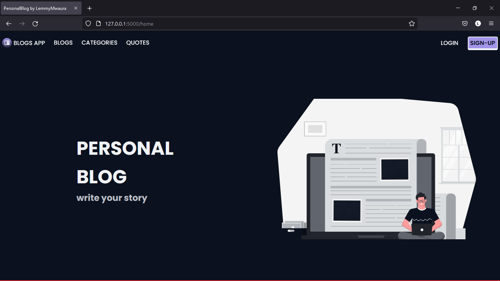

# Personal-blog
Personal-blog. Blog app built with Flask. Performs User Authentication and also Connects to a database
## Table of contents
  <!-- - [Screenshot](#screenshot) -->
  - [Project Image](#Screenshot)
  - [Project Description](#Project-description) 
  - [Built with](#built-with)
  - [License & Copywright Information](#License-and-Copywright-Information)
  - [Author](#author)

---
___

### Screenshot

___
---
### Project Description
Blog App.
Allows you to make blog posts on various fields eg (BSNS, TECH). Performs user authentication and Stores data in a database.

---
___

### BDD
 #### Context
   Given the User logs into the app
 #### Event
  When the User tries to access his/her account, log out from his/her account, make and edit blog posts...
#### Outcomes
  Then the user should be opted to signup or login.\
  The user should also be able to post new Blogs and  upvote existing blogs.\
  The user should also be able to delete their existing Blogs, their comments and comments on their posts.\
  The user should also be able to logout.

* [x] The user can create an account and login.
* [x] The user can make new blog posts.
* [x] The user can vote on a blog post.
* [x] The user can comment or offer feedbacks.
* [x] The user can delete their existing blog posts/ comments

---
___
### Built with / Technologies Used

- Python
    - Flask
    - PostgresSQL
---
___
### License and Copywright Information
(c) Stephen Lemmy Mwaura, Software Engineer.

Licensed under the [MIT License](LISENCE)

---
___
## Author 
Hi there, I'm Lemmy and i love to code. Connect With me:

- 🎱 Github - [@lemmyMwaura](https://github.com/LemmyMwaura)

---
___